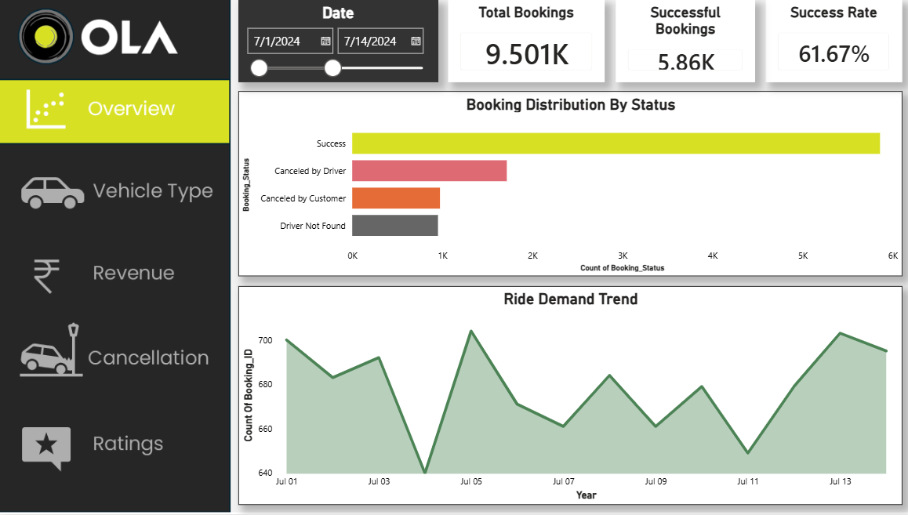

# Ola Ride Analytics Dashboard

## Project Overview

This project is an end-to-end Data Analytics solution developed using SQL, Excel, and Power BI. The dashboard analyzes over 20,000 ride-booking records and 19 business attributes to uncover insights related to ride demand, revenue generation, booking performance, vehicle utilization, cancellations, and customer satisfaction.

The objective of this project is to transform raw ride-booking data into actionable business insights through data analysis, KPI development, and interactive visualizations.

---

## Project Objectives

* Analyze overall ride-booking performance.
* Monitor booking success and cancellation trends.
* Evaluate revenue generation across multiple dimensions.
* Compare vehicle category performance.
* Identify high-value customers.
* Track customer and driver satisfaction metrics.
* Support data-driven business decision-making.

---

## Tools & Technologies

* SQL
* Microsoft Excel
* Power BI
* DAX (Data Analysis Expressions)
* Data Cleaning
* Data Transformation
* Data Modeling
* Business Intelligence
* Data Visualization

---

## Dataset Information

| Attribute     | Details                  |
| ------------- | ------------------------ |
| Domain        | Ride Sharing Analytics   |
| Total Records | 20,000+                  |
| Total Columns | 19                       |
| Data Source   | Ola Ride Booking Dataset |

### Key Features Included

* Booking ID
* Booking Date
* Booking Time
* Vehicle Type
* Booking Status
* Booking Value
* Payment Method
* Ride Distance
* Customer Rating
* Driver Rating
* Customer ID
* Cancellation Reasons
* Vehicle Information

---

## SQL Analysis

SQL was used to perform exploratory data analysis and answer business questions before dashboard development.

### Business Questions Solved

* Total number of bookings
* Successful vs cancelled rides
* Revenue generated from successful rides
* Vehicle-wise revenue analysis
* Top customers by booking value
* Payment method contribution analysis
* Average ride distance analysis
* Booking status distribution
* Customer rating analysis
* Driver rating analysis

### SQL Concepts Applied

* SELECT
* WHERE
* GROUP BY
* ORDER BY
* Aggregate Functions
* COUNT()
* SUM()
* AVG()
* Filtering & Sorting
* Business KPI Calculations

---

## Power BI Dashboard Pages

### 1. Overview Dashboard

Provides a high-level business summary.

#### KPIs

* Total Bookings
* Revenue from Successful Rides
* Success Rate
* Cancellation Rate

#### Visualizations

* Booking Status Breakdown
* Ride Demand Trend
* Date-wise Analysis
  ### Overview Dashboard

---

### 2. Vehicle Type Analysis

Analyzes performance across vehicle categories.

#### Insights

* Total Booking Value by Vehicle Type
* Successful Booking Value
* Average Distance Travelled
* Total Distance Travelled
* Vehicle Category Comparison

---

### 3. Revenue Analysis

Evaluates revenue performance and customer contribution.

#### Insights

* Revenue by Payment Method
* Top 5 Customers
* Revenue Trends
* Revenue Contribution Analysis

---

### 4. Cancellation Analysis

Examines booking cancellations and operational inefficiencies.

#### Insights

* Customer Cancellations
* Driver Cancellations
* Driver Not Found Cases
* Cancellation Distribution
* Cancellation Rate Analysis

---

### 5. Ratings Analysis

Measures service quality and user satisfaction.

#### Insights

* Customer Rating Analysis
* Driver Rating Analysis
* Rating Distribution
* Satisfaction Trends

---

## DAX Measures Implemented

### Booking Metrics

* Total Bookings
* Successful Bookings
* Cancelled Bookings

### Revenue Metrics

* Total Revenue
* Successful Ride Revenue
* Average Revenue Per Ride

### Performance Metrics

* Success Rate
* Cancellation Rate
* Average Ride Distance

---

## Key Business Insights Generated

* Identified the most profitable vehicle categories.
* Measured booking success and cancellation performance.
* Analyzed ride demand trends over time.
* Evaluated payment method contribution to revenue.
* Identified top revenue-generating customers.
* Compared vehicle performance using revenue and distance metrics.
* Assessed customer and driver satisfaction through ratings.

---

## Dashboard Features

* Interactive Filters & Slicers
* Multi-Page Navigation
* KPI Cards
* Dynamic Visualizations
* Business-Oriented Metrics
* Responsive Dashboard Layout
* Vehicle-Type Performance Analysis

---

## Project Outcomes

This dashboard enables stakeholders to:

* Monitor operational efficiency
* Improve booking success rates
* Reduce cancellations
* Track revenue performance
* Analyze customer behavior
* Support strategic business decisions

---

### Skills

* SQL
* Power BI
* Excel
* Python
* Data Visualization
* Data Analytics
* Business Intelligence

  ---
  
 ### Demo Video
👉 Watch the dashboard demo here:
  https://drive.google.com/file/d/1BAZw3y9dZSHTdqTR-CcchR7nHphPsOii/view?usp=sharing
